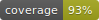

# team9-server

[](https://www.python.org/downloads/release/python-3813/)
[](https://github.com/psf/black)
[](https://pycqa.github.io/isort/)

## Prerequisite

To setup virtualenv, follow below commands. (It is based on pyenv, but it is also fine to use conda or other virtualenv tools)
```bash
$ pyenv virtualenv 3.8.13 dear_j
$ pyenv activate dear_j
$ pip install -r requirements.dev.txt
```

To apply precommit hook, please execute below command in terminal.
```bash
$ yarn install
```


### Convention
- [Python Google Style Guide](https://google.github.io/styleguide/pyguide.html)
- [Black](https://black.readthedocs.io/en/stable/)
- [Isort](https://pycqa.github.io/isort/)

#
## Development Cycle
We use 5 environments : `test`, `local`, `dev`, `stage`, `prod`
1. Test at test & local
2. Test at dev
3. Test at stage (Optional)
3. PR Review
4. Automatically deploy at prod(ec2)

| Environment     | At            | Docker           | URL                                 | Command (or Method) to run      | Description                                                                       |
|-----------------|---------------|------------------|-------------------------------------|---------------------------------|-----------------------------------------------------------------------------------|
| test            | Local         | X                | X                                   | `make test`                     | If you want to run specific test code, user `pytest {{ path }}::{{ ftn }}`.       |
| local           | Local         | X                | 127.0.0.1:8000                      | `make run-local`                | It is same with `python manage.py runserver`.                                     |
| dev             | Local         | X                | 0.0.0.0:80                          | `make run-dev`                  | It uses gunicorn. Please take care of gunicorn setting.                           |
| dev with docker | Local         | gunicorn & nginx | 0.0.0.0:80                          | `make run-dev-with-docker`      | Use if you want to test with gunicorn setting.                                    |
| stage           | AWS EC2 & ELB | gunicorn & nginx | api-staging-dearj-wafflestudio.site | Deploy at deploy/stage branch   | Https Redirect Setting.                                                           |
| prod            | AWS EC2 & ELB | gunicorn & nginx | api-dearj-wafflestudio.site         | Deploy at main branch           | Https Redirect Setting.                                                           |


### Local Server
Local server uses `python manage.py runserver` + `sqlite3`.

```bash
# team9-server/
$ make run-local  # Start Local Server - without migration.
$ make down-local # Terminate Local Server
```

### Dev Server
Dev server uses `gunicorn` + `sqlite3`.
You can use docker which is same setting with prod, if you want.

```bash
# team9-server/
$ make run-dev  # Start Dev Server - automatically migrate db
$ make down-dev # Terminate Dev Server
$ make run-dev-with-docker  # With Docker
$ make down-dev-with-docker # With Docker
```


#
## API Documentation
- [구글 캘린더 Design Doc (노션)](https://historical-garage-3bd.notion.site/Design-Doc-a2887ef59aea4f628c668729c18feecb)
- prod : https://api-dearj-wafflestudio.site/docs/swagger/
- stage : https://api-staging-dearj-wafflestudio.site/docs/swagger/
